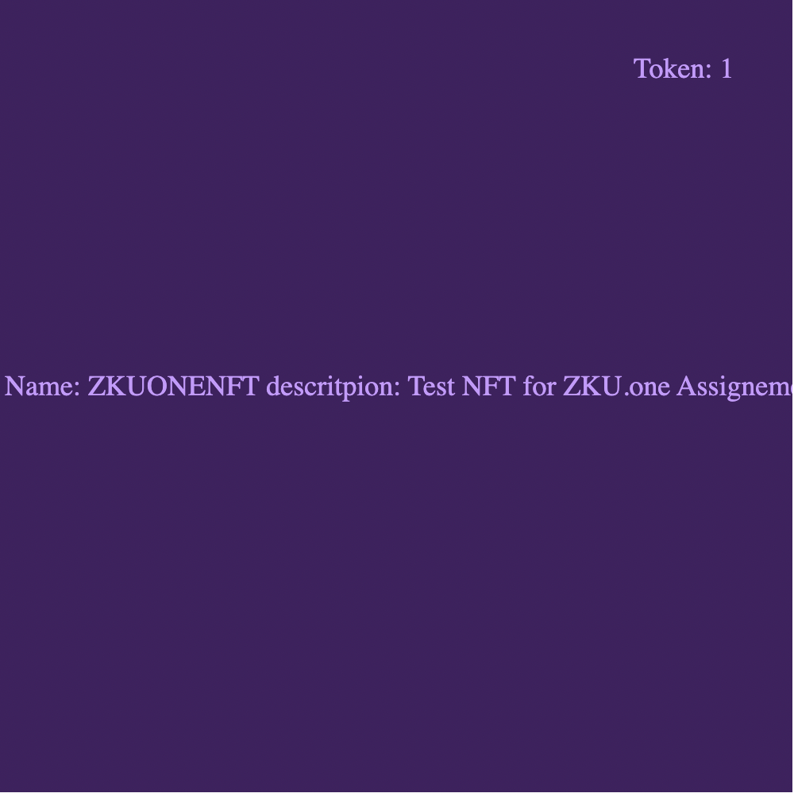
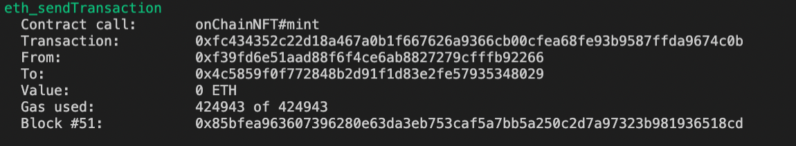

# NFT-Merkle-Tree
Set of smart contracts to minting an NFT and committing the mint data to a Merkle Tree

This repo refers to https://zku.one/course-schedule/assignment-1-due 

Question: Minting an NFT and committing the mint data to a Merkle Tree

Q1: Create an ERC721 contract that can mint an NFT to any address. The token URI should be on-chain and should include a name field and a description field. [Bonus points for well-commented codebase]

A1: Smart contract => onchainNFT.sol

The credit to the contract goes to https://medium.com/coinmonks/how-to-create-on-chain-nfts-with-solidity-1e20ff9dd87e. Using this contract I am able to incorporate user content into an NFT at mint without having to rely on external storage solutions. 

How we can get there? 

- base64 encode all the metadata related to the NFT and store it directly in our NFT token data.
To do that we'll leverage Base64.sol library

One of the more interesting features of our smart contract is the ability for user to contribute to the final NFT by inputing some text data into the mint function.

In this case the information that is gonna show up on the NFT is the a name field and a description field.

- The contract 

The minting contract takes a _nftName and _nftDescription as input parameters. These are used to populate a "Word" struct that contains the NFT on-chain metadata associated to the newly minted NFT.
It will first update the wordsToTokenId mapping associating associate the Word struct to the Token Id of the minted NFT.
To display the NFT metadata it is needed to call the .tokenURI(_tokenId) function passing the tokenId you want to get the metadata back. This function will call the nested function .buildMetadata() and .buildImage().

This is the example of NFT metadata you get from the tokenURI function 

`data:application/json;base64,eyJuYW1lIjoiWktVT05FIiwgImRlc2NyaXB0aW9uIjoiVGVzdCBORlQgZm9yIFpLVS5vbmUgQXNzaWduZW1lbnQgMSIsICJpbWFnZSI6ICJkYXRhOmltYWdlL3N2Zyt4bWw7YmFzZTY0LFBITjJaeUIzYVdSMGFEMGlOVEF3SWlCb1pXbG5hSFE5SWpVd01DSWdlRzFzYm5NOUltaDBkSEE2THk5M2QzY3Vkek11YjNKbkx6SXdNREF2YzNabklqNDhjbVZqZENCcFpEMGljM1puWHpFeElpQm9aV2xuYUhROUlqWXdNQ0lnZDJsa2RHZzlJalV3TXlJZ2VUMGlNQ0lnZUQwaU1DSWdabWxzYkQwaWFITnNLREkzTVN3MU1DVXNNalVsS1NJdlBqeDBaWGgwSUdadmJuUXRjMmw2WlQwaU1UZ2lJSGs5SWpFd0pTSWdlRDBpT0RBbElpQm1hV3hzUFNKb2Myd29Nalk1TERFd01DVXNPREFsS1NJK1ZHOXJaVzQ2SURFOEwzUmxlSFErUEhSbGVIUWdabTl1ZEMxemFYcGxQU0l4T0NJZ2VUMGlOVEFsSWlCNFBTSTFNQ1VpSUhSbGVIUXRZVzVqYUc5eVBTSnRhV1JrYkdVaUlHWnBiR3c5SW1oemJDZ3lOamtzTVRBd0pTdzRNQ1VwSWo0Z1RrWlVJRTVoYldVNklGcExWVTlPUlU1R1ZDQmtaWE5qY21sMGNHbHZiam9nVkdWemRDQk9SbFFnWm05eUlGcExWUzV2Ym1VZ1FYTnphV2R1WlcxbGJuUWdNVHd2ZEdWNGRENDhMM04yWno0PSIsICJhdHRyaWJ1dGVzIjogW3sidHJhaXRfdHlwZSI6ICJUZXh0Q29sb3IiLCJ2YWx1ZSI6IjQwIn1dfQ==` 

If you copy and paste it into the browser you get the metadata of the NFT with its name and the description of the NFT. =>

{"name":"ZKUONE", "description":"Test NFT for ZKU.one Assignement 1", "image": "data:image/svg+xml;base64,PHN2ZyB3aWR0aD0iNTAwIiBoZWlnaHQ9IjUwMCIgeG1sbnM9Imh0dHA6Ly93d3cudzMub3JnLzIwMDAvc3ZnIj48cmVjdCBpZD0ic3ZnXzExIiBoZWlnaHQ9IjYwMCIgd2lkdGg9IjUwMyIgeT0iMCIgeD0iMCIgZmlsbD0iaHNsKDI3MSw1MCUsMjUlKSIvPjx0ZXh0IGZvbnQtc2l6ZT0iMTgiIHk9IjEwJSIgeD0iODAlIiBmaWxsPSJoc2woMjY5LDEwMCUsODAlKSI+VG9rZW46IDE8L3RleHQ+PHRleHQgZm9udC1zaXplPSIxOCIgeT0iNTAlIiB4PSI1MCUiIHRleHQtYW5jaG9yPSJtaWRkbGUiIGZpbGw9ImhzbCgyNjksMTAwJSw4MCUpIj4gTkZUIE5hbWU6IFpLVU9ORU5GVCBkZXNjcml0cGlvbjogVGVzdCBORlQgZm9yIFpLVS5vbmUgQXNzaWduZW1lbnQgMTwvdGV4dD48L3N2Zz4=", "attributes": [{"trait_type": "TextColor","value":"40"}]}

As a bonus point you can also access the image of the NFT, copying and pasting the image data into the browser 

Q2: Commit the msg.sender, receiver address, tokenId, and tokenURI to a Merkle tree using the keccak256 hash function. Update the Merkle tree using a minimal amount of gas.

A2: To assemble and dinamically update the merkle tree I'm leveraging this library https://github.com/QuarkChain/DynamicMerkleTree/blob/abe6c7ee8f2fef105649943d5e329e5f5e697f8d/contracts/DynamicMerkleTree.sol

Everytime a new NFT is minted the DynamicMerkleTree.append function is called. It appends a new leaf to the merkle tree updating the rootHash state variable stored on the onChainNFT contract. In this way the contract only stores the merkle root making it more efficient. The merkle root acts as identifier of the entire merkle tree structure and can be used to verifiy if a set of msg.sender, receiver address, tokenId, and tokenURI belongs to the merkle tree.

The NFT mint takes the merkle proof (= array of hashes of the neighboring nodes) related to new leaf I'm appending to the merkle tree, as input paramater. In order to manage the NFT minting there's should be an entity that reconstructes the merkle proof off-chain before executing the minting.

The best way to do so would be using the merkletreeJs library. 

Run _verify to calculate if an hash of msg.sender, receiver address, tokenId, and tokenURI belongs to the merkle tree.

Q3: Use remix to mint a couple of NFTs to the sender address or to other addresses. Include screenshots of the transactions and the amount of gas spent per transaction in your repo.

A3:

I used the script `scripts/mint.js` to do that 

The script mints an NFT with name "ZKUONE" and description "Test NFT for ZKU.one Week 1". 

The minting function takes the NFTname, the NFTDescription, the NFT receiver and the merkle proof as inputs. 

For the first NFT minting the merkleproof equals to 0. For further NFT minting the proof must be generated off-chain before minting the NFT. 

The output that I get back from the script displays

(1) the rootHash of the merkle tree stored as storage variable before the NFT Minting 

`0x0000000000000000000000000000000000000000000000000000000000000000`

(2) The Token URI of the newly minted NFT 

`data:application/json;base64,eyJuYW1lIjoiWktVT05FIiwgImRlc2NyaXB0aW9uIjoiVGVzdCBORlQgZm9yIFpLVS5vbmUgV2VlayAxIiwgImltYWdlIjogImRhdGE6aW1hZ2Uvc3ZnK3htbDtiYXNlNjQsUEhOMlp5QjNhV1IwYUQwaU5UQXdJaUJvWldsbmFIUTlJalV3TUNJZ2VHMXNibk05SW1oMGRIQTZMeTkzZDNjdWR6TXViM0puTHpJd01EQXZjM1puSWo0OGNtVmpkQ0JwWkQwaWMzWm5YekV4SWlCb1pXbG5hSFE5SWpZd01DSWdkMmxrZEdnOUlqVXdNeUlnZVQwaU1DSWdlRDBpTUNJZ1ptbHNiRDBpYUhOc0tERTFPQ3cxTUNVc01qVWxLU0l2UGp4MFpYaDBJR1p2Ym5RdGMybDZaVDBpTVRnaUlIazlJakV3SlNJZ2VEMGlPREFsSWlCbWFXeHNQU0pvYzJ3b01URTRMREV3TUNVc09EQWxLU0krVkc5clpXNDZJREU4TDNSbGVIUStQSFJsZUhRZ1ptOXVkQzF6YVhwbFBTSXhPQ0lnZVQwaU5UQWxJaUI0UFNJMU1DVWlJSFJsZUhRdFlXNWphRzl5UFNKdGFXUmtiR1VpSUdacGJHdzlJbWh6YkNneE1UZ3NNVEF3SlN3NE1DVXBJajRnVGtaVUlFNWhiV1U2SUZwTFZVOU9SVTVHVkNCRVpYTmpjbWx3ZEdsdmJqb2dWR1Z6ZENCT1JsUWdabTl5SUZwTFZTNXZibVVnVjJWbGF5QXhQQzkwWlhoMFBqd3ZjM1puUGc9PSIsICJhdHRyaWJ1dGVzIjogW3sidHJhaXRfdHlwZSI6ICJUZXh0Q29sb3IiLCJ2YWx1ZSI6IjE4NiJ9XX0=`

(3) the rootHash of the merkle tree stored as storage variable after the NFT Minting. It represents the merkle Root of the newly generated merkle tree after the first commitment has been appended 

`0xee426e908a771d803636f8440c5cf1804a0c3820139e866fb33474a140d5fb07`

The transaction to mint an NFT, store its metadata on-chain and append the new commitment to the existing merkle tree and update the on-chain merkle root cost 424943 gas.

